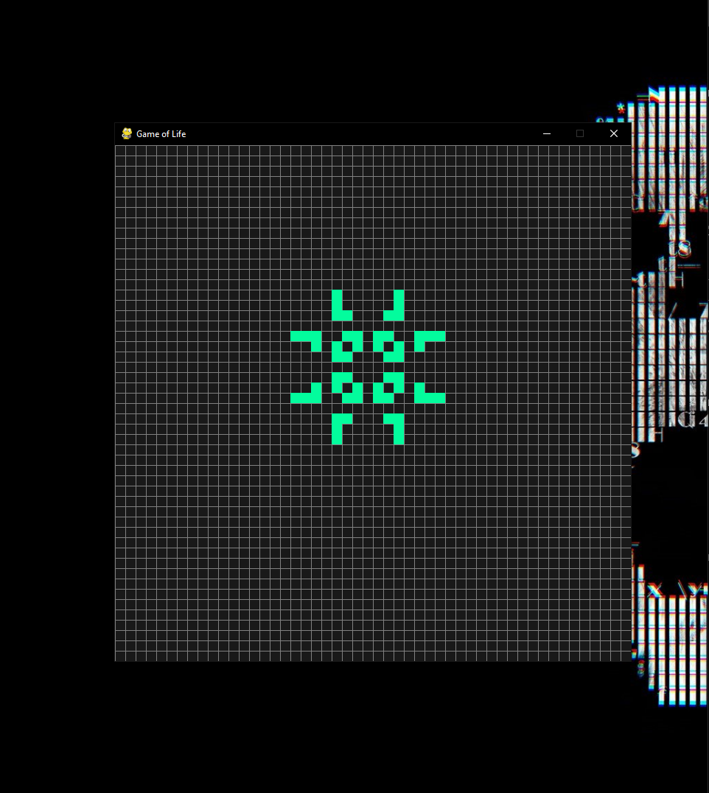

# Game Of Life
Simple Python implementation of the classical cellular automaton devised by the British mathematician John Horton Conway.

## Features
It allows you to stop the process, save the current state and load `.csv` files of other states.

## Usage
Written in python `3.X` it's as simple as `python game-of-life.py`. You'll be asked to specify an initial `.csv` state file, if not specified it starts empty.

On runtime you can press `space` to stop and resume the game, editing with `left click`to give life to cells and `right click` to kill them, press `return` to save the current state as `state.csv`.
